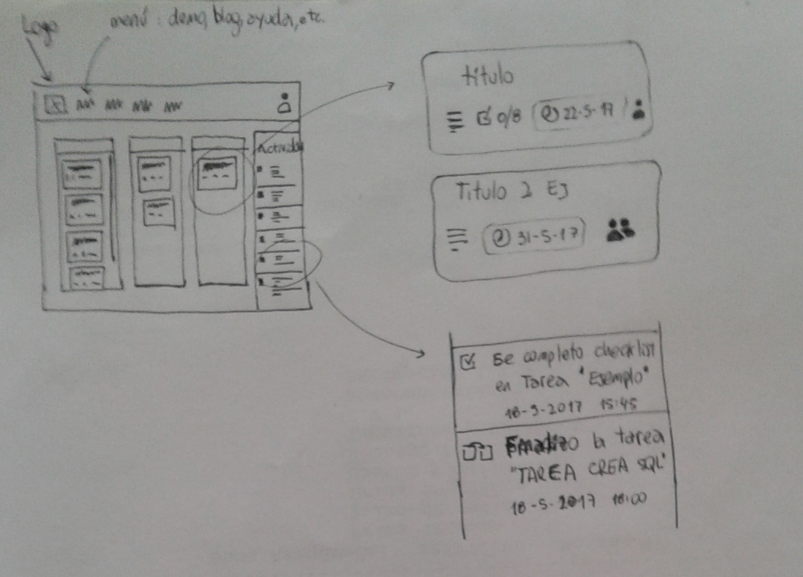
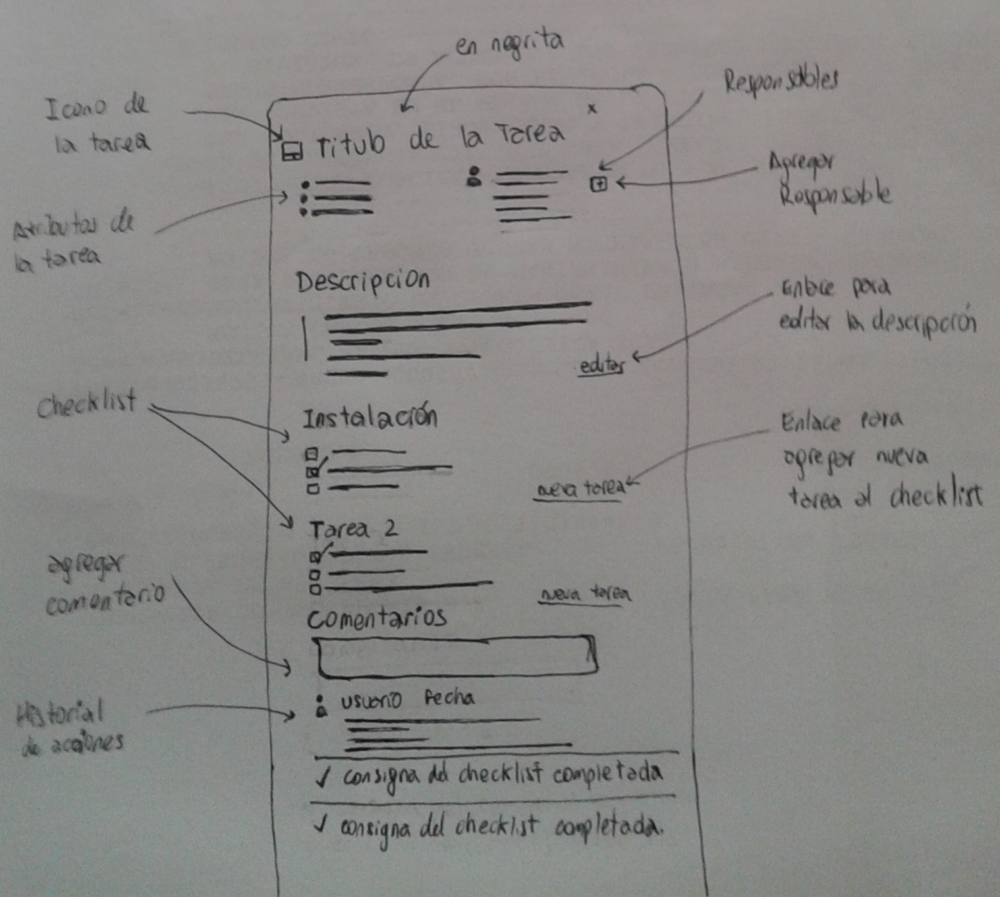

# HTML + CSS

## Enunciado
Continuando con el proyecto __TODO__, es necesario generar los siguientes __HTMLs__ y una __única hoja de estilo CSS__ que implemente:

1. Pantalla principal del usuario autenticado: *main.html*.
1. Pantalla de login: *login.html*
1. Detalle de una tarea: *tarea.html*

* Es necesario relacionar las pantallas utilizando hipervinculos de manera adecuada.
* Completar el texto del diseño Web utilizando **Lorem Ipsum**.
* Ingresar al menos 6, 2 y 1 tareas por columna respectivamente.

### **Descripción de las pantallas**

1. main.html

 - Las tres columnas corresponden a los estados de una tarea ("pendiente", "en curso", "finalizada")
 - El HEADER de la columna contiene el nombre de esta
 - Las **TAREAS PROXIMAS A VENCER** deben ser destacadas del resto. Esto puede lograrse utilizando un efecto opaco.
 - Las **TAREAS VENCIDAS** deben tambien destacarse del resto de las tareas __cuando__ se encuentran en un estado distinto a __finalizadas__.
 - En una a la derecha, se debe mostrar los cambios realizados en las tareas donde el usuario es responsable.
2. tarea.html

 - Diseñar un prototipo donde se muestre la descripcion de una tarea(al ingresar a una tarea seleccionando la misma desde la etapa anterior)

## **Fecha de entrega**

> 29/5/2017.

> Se debe subir al reposotirio Git personal versionando la entrega.
Los archivos deben ubicarse dentro de una carpeta llamada _todo_.

## **Tips**

Elementos HTML a utilizar

* header
* h1
* table --> https://css-tricks.com/complete-guide-table-element/
* div 
 - https://css-tricks.com/all-about-floats/
 - Ejemplos sencillo --> http://es.learnlayout.com/position.html
* form --> https://css-tricks.com/snippets/html/example-form-markup/
* input
* span

Elementos CSS a utilizar

* atributos, clases
* atributos:
 - display
 - position
 - font

https://www.w3schools.com/css/css_positioning.asp

## Enlaces de referencia

https://css-tricks.com/snippets/html/

https://css-tricks.com/guides/layout/

https://css-tricks.com/guides/beginner/

## **Anexo**

### **Responsive Design**: Concepto

El concepto Responsive Design hace referencia a utilizar estrategias de CSS para implementar una página Web adaptable a la resolución de pantalla del dispositivo.

A continuación les comparto este link de Google que toca este concepto.

- https://developers.google.com/web/fundamentals/design-and-ui/responsive/?hl=es-419

### **Testing**

Es posible que nuestro diseño de la página Web se visualice correctamente en un navegador Web, pero esto no nos garantiza que sea así en todos los casos. Para ello, existen herramientas que nos permite observar como se muestra nuestra página Web en distintas versiones de distintos Navegadores.

Una herramienta de este tipo es [BrowserStack](https://www.browserstack.com).

Utilizando estas herramientas podemos garantizarnos que la página diseñada se visualice correctamente en distintos navegadores sin necesidad de tenerlos instalados en nuestra equipo de desarrollo.